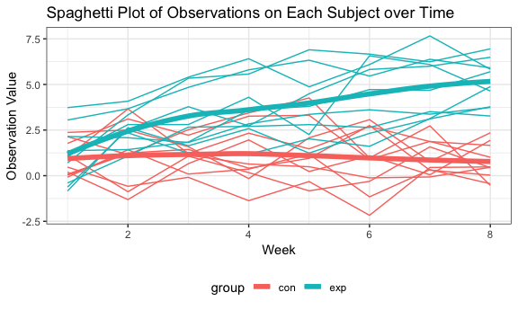
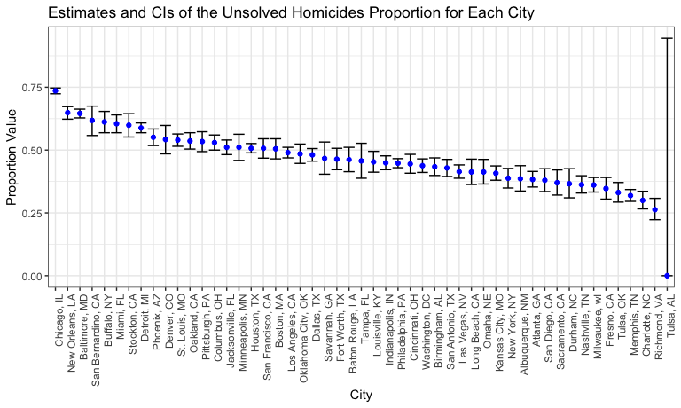

p8105\_hw5\_jl5297
================
JunLu
11/1/2018

Overview
--------

This my fifth-week homework and I am practicing iteration through this homework.

Problem 1
---------

### 1. Clean data

``` r
study_df = 
    tibble(file_name = list.files(path = "./data/study")) %>% 
    mutate(study_data = map(str_c("./data/study/", file_name), ~read_csv(.x))) %>% 
    unnest() %>%
    separate(file_name, into = c("group", "subject_id"), sep = "_") %>% 
    gather(key = "week", value = "value", week_1:week_8) %>% 
    mutate(
        subject_id = str_replace(subject_id, ".csv", ""),
        week = str_replace(week, "week_", ""),
        week = as.integer(week),
        group = factor(group, levels = c("con", "exp"), labels = c("control", "experiment"))
        ) %>% 
    arrange(group, subject_id, week)

str(study_df)
## Classes 'tbl_df', 'tbl' and 'data.frame':    160 obs. of  4 variables:
##  $ group     : Factor w/ 2 levels "control","experiment": 1 1 1 1 1 1 1 1 1 1 ...
##  $ subject_id: chr  "01" "01" "01" "01" ...
##  $ week      : int  1 2 3 4 5 6 7 8 1 2 ...
##  $ value     : num  0.2 -1.31 0.66 1.96 0.23 1.09 0.05 1.94 1.13 -0.88 ...
```

-   We use `purrr::map` to load the data of each csv file and combine them into one dataset.
-   We keep file names and transform them into two variables (`group` and `subject_id`).
-   We use `gather` to go from wide to long formats.

As a result, this tidy dataset contains 160 observations and 4 variables.

-   `group`: (factor) denote which group this subject is belong to, experiment or control group
-   `subject_id`: (chr) id number of the subject
-   `week`: (int) week of the observation
-   `value`: (num) observation vlaue

### 2. Make a spaghetti plot

``` r
study_df %>% 
    mutate(id = str_c(group, subject_id)) %>% 
    ggplot(aes(x = week, y = value, color = group)) + 
    geom_line(aes(group = id)) +
    geom_smooth(se = F, size = 2) +
    labs(
        title = "Spaghetti Plot of Observations on Each Subject over Time",
        x = "Week",
        y = "Observation Value"
    )
```



Make a spaghetti plot showing observations on each subject over time. From the plot, we can know that

-   Participants in experiment group tended to have a growth trend of observation value over weeks.
-   Participants in control group tended to have a relatively steady observation value over weeks.
-   Participants in experiment group tended to have higher observation value than participants in control group over weeks.

Problem 2
---------

### 1. Read the data

``` r
homicide = read_csv("./data/homicide-data.csv", col_types = "cccccccccddc")
str(homicide)
## Classes 'tbl_df', 'tbl' and 'data.frame':    52179 obs. of  12 variables:
##  $ uid          : chr  "Alb-000001" "Alb-000002" "Alb-000003" "Alb-000004" ...
##  $ reported_date: chr  "20100504" "20100216" "20100601" "20100101" ...
##  $ victim_last  : chr  "GARCIA" "MONTOYA" "SATTERFIELD" "MENDIOLA" ...
##  $ victim_first : chr  "JUAN" "CAMERON" "VIVIANA" "CARLOS" ...
##  $ victim_race  : chr  "Hispanic" "Hispanic" "White" "Hispanic" ...
##  $ victim_age   : chr  "78" "17" "15" "32" ...
##  $ victim_sex   : chr  "Male" "Male" "Female" "Male" ...
##  $ city         : chr  "Albuquerque" "Albuquerque" "Albuquerque" "Albuquerque" ...
##  $ state        : chr  "NM" "NM" "NM" "NM" ...
##  $ lat          : num  35.1 35.1 35.1 35.1 35.1 ...
##  $ lon          : num  -107 -107 -107 -107 -107 ...
##  $ disposition  : chr  "Closed without arrest" "Closed by arrest" "Closed without arrest" "Closed by arrest" ...
##  - attr(*, "spec")=List of 2
##   ..$ cols   :List of 12
##   .. ..$ uid          : list()
##   .. .. ..- attr(*, "class")= chr  "collector_character" "collector"
##   .. ..$ reported_date: list()
##   .. .. ..- attr(*, "class")= chr  "collector_character" "collector"
##   .. ..$ victim_last  : list()
##   .. .. ..- attr(*, "class")= chr  "collector_character" "collector"
##   .. ..$ victim_first : list()
##   .. .. ..- attr(*, "class")= chr  "collector_character" "collector"
##   .. ..$ victim_race  : list()
##   .. .. ..- attr(*, "class")= chr  "collector_character" "collector"
##   .. ..$ victim_age   : list()
##   .. .. ..- attr(*, "class")= chr  "collector_character" "collector"
##   .. ..$ victim_sex   : list()
##   .. .. ..- attr(*, "class")= chr  "collector_character" "collector"
##   .. ..$ city         : list()
##   .. .. ..- attr(*, "class")= chr  "collector_character" "collector"
##   .. ..$ state        : list()
##   .. .. ..- attr(*, "class")= chr  "collector_character" "collector"
##   .. ..$ lat          : list()
##   .. .. ..- attr(*, "class")= chr  "collector_double" "collector"
##   .. ..$ lon          : list()
##   .. .. ..- attr(*, "class")= chr  "collector_double" "collector"
##   .. ..$ disposition  : list()
##   .. .. ..- attr(*, "class")= chr  "collector_character" "collector"
##   ..$ default: list()
##   .. ..- attr(*, "class")= chr  "collector_guess" "collector"
##   ..- attr(*, "class")= chr "col_spec"
```

We load the raw data from "homicide-data.csv" and it contains 52179 observations and 12 variables. The data included the location of the killing, whether an arrest was made and, in most cases, basic demographic information about each victim.

-   `uid`: (chr) unique identifier for each homicide record
-   `reported_date`: (chr) reported date
-   `victim_last`: (chr) victim last name
-   `victim_first`: (chr) victim first name
-   `victim_race`: (chr) victim race
-   `victim_age`: (chr) victim age
-   `victim_sex`: (chr) victim age
-   `city`: (chr) occurrence city
-   `state`: (chr) occurrence state
-   `lat`: (num) occurrence latitude
-   `lon`: (num) occurrence longitude
-   `disposition`: dispostion result(whether an arrest was made)

### 2. Clean the data

``` r
homicide_tidy = 
    homicide %>% 
    mutate(city_state = str_c(city, ", ", state)) %>% 
    group_by(city_state) %>% 
    summarize(
        total_num = n(), 
        unsolved_num = sum(disposition %in% c("Closed without arrest", "Open/No arrest"))
        )

str(homicide_tidy)
## Classes 'tbl_df', 'tbl' and 'data.frame':    51 obs. of  3 variables:
##  $ city_state  : chr  "Albuquerque, NM" "Atlanta, GA" "Baltimore, MD" "Baton Rouge, LA" ...
##  $ total_num   : int  378 973 2827 424 800 614 521 687 5535 694 ...
##  $ unsolved_num: int  146 373 1825 196 347 310 319 206 4073 309 ...
```

-   Create a `city_state` variable by combining the `city` and `state`
-   Summarize within cities to obtain the total number of homicides(`total_num`) and the number of unsolved homicides(`unsolved_num`)
-   Final dataset contains 51 observations and 3 variables. There are 3 variables including `city_state`, `total_num` and `unsolved_num`.

### 3. Solutions to the problems

#### a. For the city of Baltimore, MD, find the estimate and the CI of the unsolved homicides proportion.

``` r
baltimore = 
    homicide_tidy %>% 
    filter(city_state == "Baltimore, MD")  

baltimore_prop = prop.test(baltimore$unsolved_num, baltimore$total_num)
    
baltimore_prop %>% 
    broom::tidy() %>% 
    select(estimate, conf.low, conf.high) %>% 
    knitr::kable(digits = 3)
```

|  estimate|  conf.low|  conf.high|
|---------:|---------:|----------:|
|     0.646|     0.628|      0.663|

For the city of Baltimore, MD, the estimated proportion is 0.645 and the confidence interval is (0.628, 0.663)

#### b. Create a tidy dataframe with estimated proportions and CIs for each city

``` r
prop = function(x, n){
    prop.test(x, n) %>% 
        broom::tidy() %>% 
        select(estimate, conf.low, conf.high)
}

homicide_prop = 
    homicide_tidy %>% 
    mutate(prop = map2(.x = unsolved_num, .y = total_num, ~prop(x = .x, n = .y))) %>% 
    unnest() %>%  
    janitor::clean_names() %>% 
    select(-total_num, -unsolved_num) %>% 
    mutate(
        estimate = round(estimate, 3),
        conf_low = round(conf_low, 3),
        conf_high = round(conf_high, 3)
    ) 
## Warning in prop.test(x, n): Chi-squared approximation may be incorrect

str(homicide_prop)
## Classes 'tbl_df', 'tbl' and 'data.frame':    51 obs. of  4 variables:
##  $ city_state: chr  "Albuquerque, NM" "Atlanta, GA" "Baltimore, MD" "Baton Rouge, LA" ...
##  $ estimate  : num  0.386 0.383 0.646 0.462 0.434 0.505 0.612 0.3 0.736 0.445 ...
##  $ conf_low  : num  0.337 0.353 0.628 0.414 0.399 0.465 0.569 0.266 0.724 0.408 ...
##  $ conf_high : num  0.438 0.415 0.663 0.511 0.469 0.545 0.654 0.336 0.747 0.483 ...
```

We create a function to do `prop.test` and extract the estimate and the CI from the result. And then use `purrr::map2`, list columns and unnest to create a tidy dataframe with estimated proportions and CIs for each city. Notably, for some cities Chi-squared approximation may be incorrect.

The homicide\_prop dataset contains 51 observations and 4 variables including `city_state`, `estimate`, `conf_low` and `conf_high`.

#### c. Create a plot that shows the estimates and CIs for each city

``` r
homicide_prop %>% 
    mutate(city_state = forcats::fct_reorder(city_state, estimate, .desc = T)) %>% 
    ggplot(aes(x = city_state, y = estimate)) +
    geom_errorbar(aes(x = city_state, ymin = conf_low, ymax = conf_high)) +
    geom_point(color = "blue") +
    theme(axis.text.x = element_text(angle = 90, hjust = 1)) +
    labs(
        title = "Estimates and CIs of the Unsolved Homicides Proportion for Each City ",
        y = "Proportion Value",
        x = "City"
    )
```



From the plot we can know clearly that the estimated proportion of unsolved homicides in Chicago is the largest.
