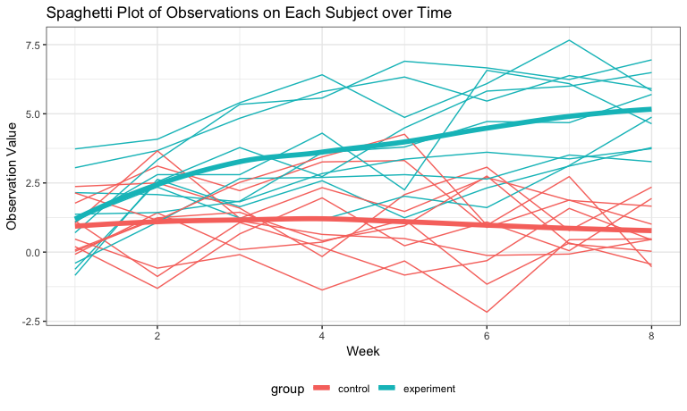

p8105\_hw5\_jl5297
================
JunLu
11/1/2018

Overview
--------

This my fifth-week homework and I am practicing iteration through this homework.

Problem 1
---------

### 1. Clean data

``` r
study_df = 
    tibble(file_name = list.files(path = "./data")) %>% 
    mutate(study_data = map(str_c("./data/", file_name), ~read_csv(.x))) %>% 
    unnest() %>%
    separate(file_name, into = c("group", "subject_id"), sep = "_") %>% 
    gather(key = "week", value = "value", week_1:week_8) %>% 
    mutate(subject_id = str_replace(subject_id, ".csv", ""),
           week = str_replace(week, "week_", ""),
           week = as.integer(week)) %>% 
    arrange(group, subject_id, week)

str(study_df)
## Classes 'tbl_df', 'tbl' and 'data.frame':    160 obs. of  4 variables:
##  $ group     : chr  "con" "con" "con" "con" ...
##  $ subject_id: chr  "01" "01" "01" "01" ...
##  $ week      : int  1 2 3 4 5 6 7 8 1 2 ...
##  $ value     : num  0.2 -1.31 0.66 1.96 0.23 1.09 0.05 1.94 1.13 -0.88 ...
```

-   We use `purrr::map` to load the data of each csv file and combine them into one dataset.
-   We keep file names and transform them into two variables (`group` and `subject_id`).
-   We use `gather` to go from wide to long formats.

As a result, this tidy dataset contains 160 observations and 4 variables.

-   `group`: (chr) denote which group this subject is belong to, experiment or control group
-   `subject_id`: (chr) id number of the subject
-   `week`: (int) week of the observation
-   `value`: (num) observation vlaue

### 2. Make a spaghetti plot

``` r
study_df %>% 
    mutate(id = str_c(group, subject_id)) %>% 
    ggplot(aes(x = week, y = value, color = group)) + 
    geom_line(aes(group = id)) +
    geom_smooth(se = F, size = 2) +
    labs(
        title = "Spaghetti Plot of Observations on Each Subject over Time",
        x = "Week",
        y = "Observation Value"
    )
```



Make a spaghetti plot showing observations on each subject over time. From the plot, we can know that

-   Participants in experiment group tended to have a growth trend of observation value over weeks.
-   Participants in control group tended to have a relatively steady observation value over weeks.
